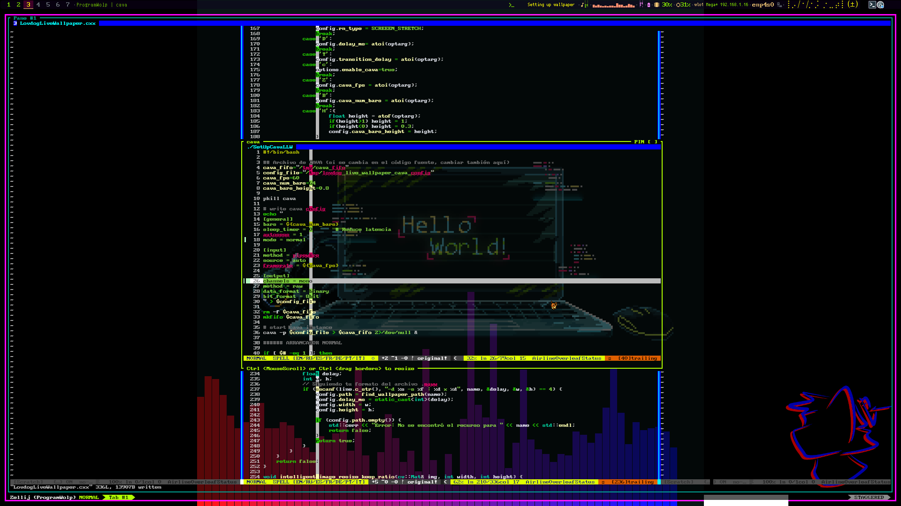

# LovdogLiveWallpaper

Live Wallpaper manager for `xcb` based window managers

Since I've seen most of the approaches tends to be focused on `xwinwrap` or bash scripts to loop using `feh`, I though it could be good to create the same `feh -D` slideshow but in the desktop root.

## Why this and not xwinwrap or feh

Mainly, less resources and less steps in the middle, so no bash interpreter and no bash loops which can slow the framerate and increment the resources consumption.

About `xwinwrap`, there's an important problem for any tiling window like `zwm` or `i3wm` which sometimes handle the new root window as another tiled window and they're not fullscreen.



## Small documentation

### Compilation stuff

You'll need `make`, `gcc`, `opencv-devel`, `fontconfig-devel` and `xcb-devel` packages to compile this. May vary by distro I'm using void.
If you're on `debian`-based distros, it should be `dev` instead of `devel`. Check about underscores and naming conventions per distro.

To compile use `make build`
To compile use `make build`

### For usage

```
llw -v | --video            <video path>
llw -f | --descriptor-file  <descriptor.maww>
llw -i | --descriptor-id    <wallpaper id>
llw -s | --send-stop
llw -F | --bg-fill
llw -S | --bg-stretch
llw -C | --bg-center
llw -d | --slideshow        <directory>
llw -D | --slideshow-delay  <int_ms>
llw -T | --transition-delay <int_ms>
llw -c | --cava
llw -Z | --cava-fps         <int_framerate>
llw -H | --cava-height      <float_0_to_1_height_proportion>
llw -R | --cava-rgb         <'#XXXXXX'>
llw -K | --cava-rgb-rng     <'#XXXXXX:#YYYYYY'>
llw -r | --cava-rgb-rnd
llw -B | --cava-bars        <int_number_of_bars>
llw -A | --cava-rgb-ada
llw -w | --widget-cmd       <string executable|command reads stdout>
llw -P | --widget-pos       <x_proportional_to_width:y_proportional_to_height>
llw -X | --widget-fsz       <int font_size>
llw -M | --widget-fnt       <string font_name>
llw -M | --widget-delay     <int frames_to_count>
llw -h | --help
```

The `--send-stop` flag is used to stop the wallpaper. This is to avoid memory leaks due to the frame load.

Descriptor files corresponds to files created by the script `add_animated_wallpaper` which used `ffmpeg` or `ImageMagick` to extract video and gif files into directories for use with a modified version of `maww`.

Each descriptor is given by the syntax `-d id -s period :  width x height` The period is given by 1000/fps. As an example:

The `slideshow` does not respond yet to background styles options `fill`, `center` and `stretch`. The current version does a *fill*.

For `CAVA` implementation I did a script `SetUpCavaLLW` so you can modify it to better suit your needs.

Currently `CAVA` integration works only with `GIF/VIDEO` options. And is set to default it's width to the `GIF/VIDEO` width.

`LLW` is not intended to send commands to main instance except for `--send-stop`. Make sure to stop any `LLW` instance before running a new one.

```
-d Asciiquarium -s 100 :  640 x 360
```

### Compatible formats
At the moment, tested video formats are
```
mkv
webm
mp4
```

About length of the video, I didn't used videos larger than 2min., so larger ones may result on further RAM usage, **be careful**

### Important dirs

I must say there's **no** parser for any **config** file. But any descriptor file should be placed at (precedence order):
```
$HOME/.SYS_IMAGES
$HOME/.WallPapers
$HOME/local/sys_images
$HOME/local/wallpapers
```
Inside each one there could be any `VIDEOS` and or `GIFS` directory for the `SetDescriptorLLW` script which should be also placed in the *wallpapers* directory
That script is intended to be used as the *trigger*  for the wallpaper manager, performs a search and shuffles to initiate a random wallpaper. This script is nor needed nor important but an utility.

### Installation

In order to install, the command is pretty simple

The `make install` has sudo in it, so no need to `sudo make install` avoiding possible root ownership issues regarding additional steps in the future.

Now `m̀ake` with **no arguments** is enough to build and install. Please make sure, your instance is not running before updating.

```
make build
make install
```

### TODO

Since I'm in masters studies toward research curriculum I cannot assure I'll add every element in todo. At least, not as fast as I want.

[ x ] Add screen pixmap resizing options
[ x ] Add CAVA-like visualization
[ x ] Add slideshow
[  ] Add system info monitoring
[ x ] Add widget-like element


As the obsessive wolf I am, and with the high amount of ideas here's a list of maybes I got in my head:
 - Make LovdogWallpaperManager
 - Add extras like power management
 - Pop up notifications
 - Add mpv-like yt-dlp support for online videos
 - Add sound support if music/fx synced with wallpaper

